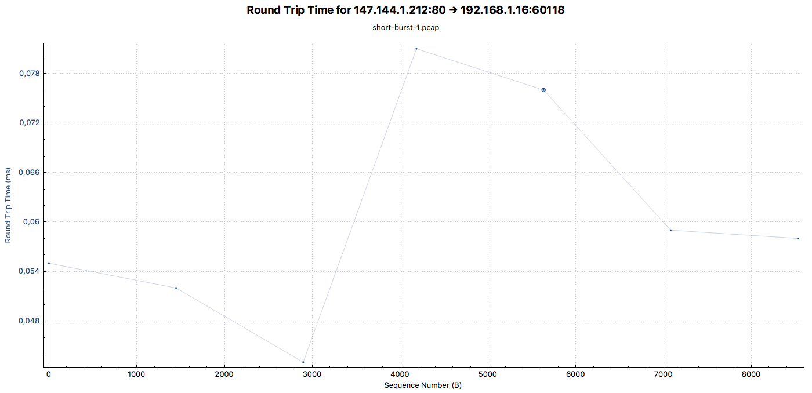
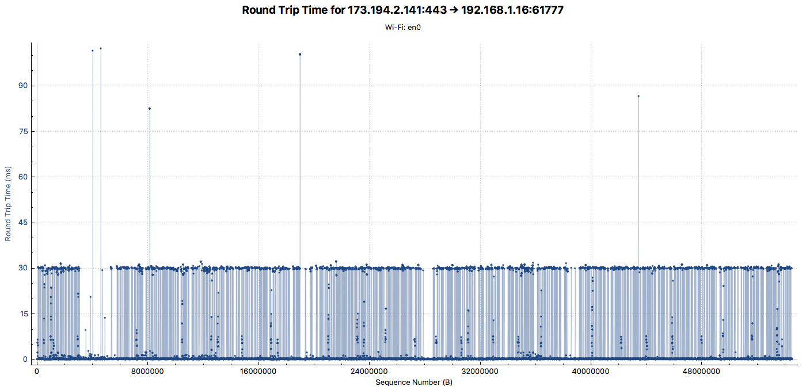

# Packet sniffing with Wireshark

Author: *Buğra Ekuklu*, 150120016

#### Time and place

##### Short-burst

ITU ARI 3 Teknokent
Istanbul Technical University, Ayazaga, Istanbul, Turkey.

April 22nd, 2018. 03:20:18

##### Long-burst

Buy Buddy Anonim Sirketi
Unalan, Uskudar, Istanbul, Turkey.

April 22nd, 2018. 05:18:20

#### Computer specifications

Model: MacBookPro10,2
Manufacturer: Apple
CPU: Intel Core i5
CPU Freq.: 2.5 GHz
Number of CPUs: 2
L2 Cache: 256 KB
L3 Cache: 3 MB
RAM: 8 GB, 1600 MHz, LPDDR3

### Analyzing short-burst traffic

Assuming we have the IP address `192.168.1.16`, we could sniff TCP traffic on our network by using various *Wireshark* filters. 
We are going to make an HTTP request from our web browser to the website *ccsf.edu*. 
In order to inspect this operation in *Wireshark*, we could use following information to build our filtering expression.

1. Our IP address is 192.168.1.16. HTTP protocol uses TCP/IP sockets for sending the request and receiving the response. Hence, our IP address will be contained in both source and destination fields.

```
(ip.src == 192.168.1.16 or ip.dst == 192.168.1.16)
```

2. *HTTP* protocol uses port 80 as default, if port is not specified on browser, it will attempt to connect to the default port.
In our case, we didn't write any port field to the URL of the website, hence the port will be 80.

```
tcp.port == 80
```

Combining these two predicates, it results in the following predicate. 

```
(ip.src == 192.168.1.16 or ip.dst == 192.168.1.16) and tcp.port == 80
```

When we apply a display filter to the sniffed packets, the following table will be shown in *Wireshark*.

| "No." | "Time"     | "Source"          | "Destination"     | "Protocol" | "Length"                                                                                                       | "Info"                                                                                                                          | 
|-------|------------|-------------------|-------------------|------------|----------------------------------------------------------------------------------------------------------------|---------------------------------------------------------------------------------------------------------------------------------| 
| "82"  | "3.957871" | "192.168.1.16"    | "147.144.1.212"   | "HTTP"     | "527"                                                                                                          | "GET / HTTP/1.1 "                                                                                                               | 
| "83"  | "3.959394" | "192.168.1.16"    | "172.217.169.110" | "HTTP"     | "1059"                                                                                                         | "GET /translate_a/element.js?cb=googleTranslateElementInit HTTP/1.1 "                                                           | 
| "84"  | "3.959475" | "147.144.1.212"   | "192.168.1.16"    | "TCP"      | "66"                                                                                                           | "80  >  60118 [ACK] Seq=1 Ack=462 Win=516 Len=0 TSval=3138252895 TSecr=382269243"                                               | 
| "85"  | "3.960583" | "147.144.1.212"   | "192.168.1.16"    | "TCP"      | "1514"                                                                                                         | "80  >  60118 [ACK] Seq=1 Ack=462 Win=520 Len=1448 TSval=3138252895 TSecr=382269243 [TCP segment of a reassembled PDU]"         | 
| "86"  | "3.960586" | "147.144.1.212"   | "192.168.1.16"    | "TCP"      | "1514"                                                                                                         | "80  >  60118 [ACK] Seq=1449 Ack=462 Win=520 Len=1448 TSval=3138252895 TSecr=382269243 [TCP segment of a reassembled PDU]"      | 
| "87"  | "3.960619" | "147.144.1.212"   | "192.168.1.16"    | "TCP"      | "1355"                                                                                                         | "80  >  60118 [PSH, ACK] Seq=2897 Ack=462 Win=520 Len=1289 TSval=3138252895 TSecr=382269243 [TCP segment of a reassembled PDU]" | 
| "88"  | "3.960620" | "172.217.169.110" | "192.168.1.16"    | "TCP"      | "66"                                                                                                           | "80  >  60123 [ACK] Seq=1 Ack=994 Win=512 Len=0 TSval=123359468 TSecr=382269244"                                                | 
| "89"  | "3.960638" | "192.168.1.16"    | "147.144.1.212"   | "TCP"      | "66"                                                                                                           | "60118  >  80 [ACK] Seq=462 Ack=2897 Win=4005 Len=0 TSval=382269245 TSecr=3138252895"                                           | 
| "90"  | "3.960662" | "192.168.1.16"    | "147.144.1.212"   | "TCP"      | "66"                                                                                                           | "60118  >  80 [ACK] Seq=462 Ack=4186 Win=3965 Len=0 TSval=382269245 TSecr=3138252895"                                           | 
| "91"  | "3.960722" | "192.168.1.16"    | "172.217.169.110" | "TCP"      | "78"                                                                                                           | "60231  >  80 [SYN] Seq=0 Win=65535 Len=0 MSS=1460 WS=32 TSval=382269245 TSecr=0 SACK_PERM=1"                                   | 
| "92"  | "3.960776" | "192.168.1.16"    | "147.144.1.212"   | "TCP"      | "66","[TCP Window Update] 60118  >  80 [ACK] Seq=462 Ack=4186 Win=4093 Len=0 TSval=382269245 TSecr=3138252895" |                                                                                                                                 | 
| "93"  | "3.962756" | "147.144.1.212"   | "192.168.1.16"    | "TCP"      | "1514"                                                                                                         | "80  >  60118 [ACK] Seq=4186 Ack=462 Win=520 Len=1448 TSval=3138252895 TSecr=382269245 [TCP segment of a reassembled PDU]"      | 
| "94"  | "3.962761" | "147.144.1.212"   | "192.168.1.16"    | "TCP"      | "1514"                                                                                                         | "80  >  60118 [ACK] Seq=5634 Ack=462 Win=520 Len=1448 TSval=3138252895 TSecr=382269245 [TCP segment of a reassembled PDU]"      | 
| "95"  | "3.962808" | "147.144.1.212"   | "192.168.1.16"    | "TCP"      | "1514"                                                                                                         | "80  >  60118 [ACK] Seq=7082 Ack=462 Win=520 Len=1448 TSval=3138252895 TSecr=382269245 [TCP segment of a reassembled PDU]"      | 
| "96"  | "3.962809" | "147.144.1.212"   | "192.168.1.16"    | "HTTP"     | "899"                                                                                                          | "HTTP/1.1 200 OK  (text/html)"                                                                                                  | 
| "97"  | "3.962810" | "172.217.169.110" | "192.168.1.16"    | "TCP"      | "74"                                                                                                           | "80  >  60231 [SYN, ACK] Seq=0 Ack=1 Win=65228 Len=0 MSS=1460 WS=128 SACK_PERM=1 TSval=1002148820 TSecr=382269245"              | 
| "98"  | "3.962837" | "192.168.1.16"    | "147.144.1.212"   | "TCP"      | "66"                                                                                                           | "60118  >  80 [ACK] Seq=462 Ack=7082 Win=4005 Len=0 TSval=382269247 TSecr=3138252895"                                           | 
| "99"  | "3.962867" | "192.168.1.16"    | "172.217.169.110" | "TCP"      | "66"                                                                                                           | "60231  >  80 [ACK] Seq=1 Ack=1 Win=131744 Len=0 TSval=382269247 TSecr=1002148820"                                              | 
| "100" | "3.962867" | "192.168.1.16"    | "147.144.1.212"   | "TCP"      | "66"                                                                                                           | "60118  >  80 [ACK] Seq=462 Ack=9363 Win=3934 Len=0 TSval=382269247 TSecr=3138252895"                                           | 
| "101" | "3.962920" | "192.168.1.16"    | "147.144.1.212"   | "TCP"      | "66","[TCP Window Update] 60118  >  80 [ACK] Seq=462 Ack=9363 Win=4096 Len=0 TSval=382269247 TSecr=3138252895" |                                                                                                                                 | 
| "102" | "3.964266" | "192.168.1.16"    | "172.217.169.110" | "HTTP"     | "1105"                                                                                                         | "GET /gen204?sl=en&nca=te_ap&client=te&logld=vTE_20170911_00 HTTP/1.1 "                                                         | 
| "103" | "3.965911" | "172.217.169.110" | "192.168.1.16"    | "TCP"      | "66"                                                                                                           | "80  >  60231 [ACK] Seq=1 Ack=1040 Win=65536 Len=0 TSval=1002148820 TSecr=382269248"                                            | 
| "104" | "4.007949" | "192.168.1.16"    | "172.217.169.110" | "TCP"      | "78"                                                                                                           | "60232  >  80 [SYN] Seq=0 Win=65535 Len=0 MSS=1460 WS=32 TSval=382269290 TSecr=0 SACK_PERM=1"                                   | 
| "105" | "4.009773" | "172.217.169.110" | "192.168.1.16"    | "TCP"      | "74"                                                                                                           | "80  >  60232 [SYN, ACK] Seq=0 Ack=1 Win=65228 Len=0 MSS=1460 WS=128 SACK_PERM=1 TSval=1304392743 TSecr=382269290"              | 
| "106" | "4.009844" | "192.168.1.16"    | "172.217.169.110" | "TCP"      | "66"                                                                                                           | "60232  >  80 [ACK] Seq=1 Ack=1 Win=131744 Len=0 TSval=382269292 TSecr=1304392743"                                              | 
| "107" | "4.010343" | "192.168.1.16"    | "172.217.169.110" | "HTTP"     | "1059"                                                                                                         | "GET /translate_a/element.js?cb=googleTranslateElementInit HTTP/1.1 "                                                           | 
| "108" | "4.011938" | "172.217.169.110" | "192.168.1.16"    | "TCP"      | "66"                                                                                                           | "80  >  60232 [ACK] Seq=1 Ack=994 Win=65536 Len=0 TSval=1304392743 TSecr=382269292"                                             | 
| "121" | "4.059027" | "172.217.169.110" | "192.168.1.16"    | "TCP"      | "790"                                                                                                          | "80  >  60123 [PSH, ACK] Seq=1 Ack=994 Win=520 Len=724 TSval=123359477 TSecr=382269244 [TCP segment of a reassembled PDU]"      | 
| "122" | "4.059032" | "172.217.169.110" | "192.168.1.16"    | "HTTP"     | "836"                                                                                                          | "HTTP/1.1 200 OK  (text/javascript)"                                                                                            | 
| "123" | "4.059119" | "192.168.1.16"    | "172.217.169.110" | "TCP"      | "66"                                                                                                           | "60123  >  80 [ACK] Seq=994 Ack=725 Win=4073 Len=0 TSval=382269335 TSecr=123359477"                                             | 
| "124" | "4.059120" | "192.168.1.16"    | "172.217.169.110" | "TCP"      | "66"                                                                                                           | "60123  >  80 [ACK] Seq=994 Ack=1495 Win=4049 Len=0 TSval=382269335 TSecr=123359477"                                            | 
| "130" | "4.094344" | "172.217.169.110" | "192.168.1.16"    | "HTTP"     | "678"                                                                                                          | "HTTP/1.1 204 No Content "                                                                                                      | 
| "131" | "4.094455" | "192.168.1.16"    | "172.217.169.110" | "TCP"      | "66"                                                                                                           | "60231  >  80 [ACK] Seq=1040 Ack=613 Win=131136 Len=0 TSval=382269368 TSecr=1002148833"                                         | 
| "135" | "4.164954" | "172.217.169.110" | "192.168.1.16"    | "TCP"      | "790"                                                                                                          | "80  >  60232 [PSH, ACK] Seq=1 Ack=994 Win=66560 Len=724 TSval=1304392758 TSecr=382269292 [TCP segment of a reassembled PDU]"   | 
| "136" | "4.164970" | "172.217.169.110" | "192.168.1.16"    | "HTTP"     | "836"                                                                                                          | "HTTP/1.1 200 OK  (text/javascript)"                                                                                            | 
| "137" | "4.165202" | "192.168.1.16"    | "172.217.169.110" | "TCP"      | "66"                                                                                                           | "60232  >  80 [ACK] Seq=994 Ack=725 Win=131040 Len=0 TSval=382269438 TSecr=1304392758"                                          | 
| "138" | "4.165203" | "192.168.1.16"    | "172.217.169.110" | "TCP"      | "66"                                                                                                           | "60232  >  80 [ACK] Seq=994 Ack=1495 Win=130272 Len=0 TSval=382269438 TSecr=1304392758"                                         | 
| "199" | "4.372211" | "192.168.1.16"    | "172.217.169.110" | "HTTP"     | "1105"                                                                                                         | "GET /gen204?sl=en&nca=te_ap&client=te&logld=vTE_20170911_00 HTTP/1.1 "                                                         | 
| "200" | "4.374004" | "172.217.169.110" | "192.168.1.16"    | "TCP"      | "66"                                                                                                           | "80  >  60123 [ACK] Seq=1495 Ack=2033 Win=512 Len=0 TSval=123359509 TSecr=382269634"                                            | 
| "226" | "4.465984" | "172.217.169.110" | "192.168.1.16"    | "HTTP"     | "678"                                                                                                          | "HTTP/1.1 204 No Content "                                                                                                      | 
| "227" | "4.466076" | "192.168.1.16"    | "172.217.169.110" | "TCP"      | "66"                                                                                                           | "60123  >  80 [ACK] Seq=2033 Ack=2107 Win=4076 Len=0 TSval=382269723 TSecr=123359518"                                           | 

Notice that there are still TCP entries not related to our task.
We could filter the results by requesting only for the HTTP-related packets by adding following predicate to the filter.

```
http
```

Our new filtering predicate will be as follows.

```
(ip.src == 192.168.1.16 or ip.dst == 192.168.1.16) and tcp.port == 80 and http
```

The resulting packets are much more precise than our initial attempt.

| "No." | "Time"     | "Source"          | "Destination"     | "Protocol" | "Length" | "Info"                                                                  | 
|-------|------------|-------------------|-------------------|------------|----------|-------------------------------------------------------------------------| 
| "82"  | "3.957871" | "192.168.1.16"    | "147.144.1.212"   | "HTTP"     | "527"    | "GET / HTTP/1.1 "                                                       | 
| "83"  | "3.959394" | "192.168.1.16"    | "172.217.169.110" | "HTTP"     | "1059"   | "GET /translate_a/element.js?cb=googleTranslateElementInit HTTP/1.1 "   | 
| "96"  | "3.962809" | "147.144.1.212"   | "192.168.1.16"    | "HTTP"     | "899"    | "HTTP/1.1 200 OK  (text/html)"                                          | 
| "102" | "3.964266" | "192.168.1.16"    | "172.217.169.110" | "HTTP"     | "1105"   | "GET /gen204?sl=en&nca=te_ap&client=te&logld=vTE_20170911_00 HTTP/1.1 " | 
| "107" | "4.010343" | "192.168.1.16"    | "172.217.169.110" | "HTTP"     | "1059"   | "GET /translate_a/element.js?cb=googleTranslateElementInit HTTP/1.1 "   | 
| "122" | "4.059032" | "172.217.169.110" | "192.168.1.16"    | "HTTP"     | "836"    | "HTTP/1.1 200 OK  (text/javascript)"                                    | 
| "130" | "4.094344" | "172.217.169.110" | "192.168.1.16"    | "HTTP"     | "678"    | "HTTP/1.1 204 No Content "                                              | 
| "136" | "4.164970" | "172.217.169.110" | "192.168.1.16"    | "HTTP"     | "836"    | "HTTP/1.1 200 OK  (text/javascript)"                                    | 
| "199" | "4.372211" | "192.168.1.16"    | "172.217.169.110" | "HTTP"     | "1105"   | "GET /gen204?sl=en&nca=te_ap&client=te&logld=vTE_20170911_00 HTTP/1.1 " | 
| "226" | "4.465984" | "172.217.169.110" | "192.168.1.16"    | "HTTP"     | "678"    | "HTTP/1.1 204 No Content "                                              | 

Looking for the package with the number *82*, since we requested to the root path of the website, our destination address is `147.144.1.212`.
We could filter the remaining packets by adding the destination address as a predicate.

```
(ip.src == 147.144.1.212 or ip.dst == 147.144.1.212)
```

This adds to our predicate.

```
(ip.src == 192.168.1.16 or ip.dst == 192.168.1.16) and tcp.port == 80 and http and (ip.src == 147.144.1.212 or ip.dst == 147.144.1.212)
```

| "No." | "Time"     | "Source"        | "Destination"   | "Protocol" | "Length" | "Info"                         | 
|-------|------------|-----------------|-----------------|------------|----------|--------------------------------| 
| "82"  | "3.957871" | "192.168.1.16"  | "147.144.1.212" | "HTTP"     | "527"    | "GET / HTTP/1.1 "              | 
| "96"  | "3.962809" | "147.144.1.212" | "192.168.1.16"  | "HTTP"     | "899"    | "HTTP/1.1 200 OK  (text/html)" | 

Removing the `http` predicate from our filters, we could reach all of the TCP traffic.

| "No." | "Time"     | "Source"        | "Destination"   | "Protocol" | "Length" | "Info"                                                                                                                          | 
|-------|------------|-----------------|-----------------|------------|----------|---------------------------------------------------------------------------------------------------------------------------------| 
| "1"   | "0.000000" | "192.168.1.16"  | "147.144.1.212" | "HTTP"     | "527"    | "GET / HTTP/1.1 "                                                                                                               | 
| "2"   | "0.002712" | "147.144.1.212" | "192.168.1.16"  | "TCP"      | "1514"   | "80  >  60118 [ACK] Seq=1 Ack=462 Win=520 Len=1448 TSval=3138252895 TSecr=382269243 [TCP segment of a reassembled PDU]"         | 
| "3"   | "0.002715" | "147.144.1.212" | "192.168.1.16"  | "TCP"      | "1514"   | "80  >  60118 [ACK] Seq=1449 Ack=462 Win=520 Len=1448 TSval=3138252895 TSecr=382269243 [TCP segment of a reassembled PDU]"      | 
| "4"   | "0.002748" | "147.144.1.212" | "192.168.1.16"  | "TCP"      | "1355"   | "80  >  60118 [PSH, ACK] Seq=2897 Ack=462 Win=520 Len=1289 TSval=3138252895 TSecr=382269243 [TCP segment of a reassembled PDU]" | 
| "5"   | "0.004885" | "147.144.1.212" | "192.168.1.16"  | "TCP"      | "1514"   | "80  >  60118 [ACK] Seq=4186 Ack=462 Win=520 Len=1448 TSval=3138252895 TSecr=382269245 [TCP segment of a reassembled PDU]"      | 
| "6"   | "0.004890" | "147.144.1.212" | "192.168.1.16"  | "TCP"      | "1514"   | "80  >  60118 [ACK] Seq=5634 Ack=462 Win=520 Len=1448 TSval=3138252895 TSecr=382269245 [TCP segment of a reassembled PDU]"      | 
| "7"   | "0.004937" | "147.144.1.212" | "192.168.1.16"  | "TCP"      | "1514"   | "80  >  60118 [ACK] Seq=7082 Ack=462 Win=520 Len=1448 TSval=3138252895 TSecr=382269245 [TCP segment of a reassembled PDU]"      | 
| "8"   | "0.004938" | "147.144.1.212" | "192.168.1.16"  | "HTTP"     | "899"    | "HTTP/1.1 200 OK  (text/html)"                                                                                                  | 

#### Round-trip time of the flow

The TCP round-trip time analysis between our client and the server can be derived from our last filtering.



#### Sequence & acknowledgement analysis

As it is shown in the table, HTTP response is sent in 6 TCP segments.
The sequence number starts from 1, and on each successful transmission, the acknowledge is sent with the same value of 462, and the next sequence number is added the length of the packet.
In packet with number 4, there is push flag, `PSH`, involved.
This is due to package is smaller than the common length negotiated during `SYN` of TCP bootstrapping.

During transmission, there was no error, hence no retransmission occurred.

### Analyzing long-burst traffic

Without changing our local IP `192.168.1.16`, we could sniff TCP traffic on our network while watching a video on [YouTube](https://youtube.com).
We open https://www.youtube.com/watch?v=aF8E4j1EVRY in a web browser and start sniffing.

By sorting the packets by total data size of the stream, we could understand that `173.194.2.141` is the source address of the video data transmitted through TCP.
We can filter the packets by applying following filter.

```
ip.src == 173.194.2.141
```

Our address is also destination, adding the next filter.

```
ip.dst == 192.168.1.16
```

We also want to filter the TCP packets.

```
tcp
```

We finally have the following predicate.

```
ip.src == 173.194.2.141 and ip.dst == 192.168.1.16 and tcp
```

Another thing we want is TCP retransmissions. Following predicate filters that.

```
tcp.analysis.retransmission
```

#### Round-trip time of the flow



#### Sequence & acknowledgement analysis

Length of the packets are 1420 and constant during transmission.
Transmission of media data starts at 1421th sequence.

Using `ip.src == 173.194.2.141 and ip.dst == 192.168.1.16 and tcp.analysis.retransmission` we could derive retransmitted packages.
There was only one package retransmitted.

| "No."   | "Time"       | "Source"        | "Destination"  | "Protocol" | "Length"                                                                                                                   | "Info" | 
|---------|--------------|-----------------|----------------|------------|----------------------------------------------------------------------------------------------------------------------------|--------| 
| "41570" | "127.124867" | "173.194.2.141" | "192.168.1.16" | "TCP"      | "1486","[TCP Retransmission] 443  >  61777 [ACK] Seq=38358463 Ack=33613 Win=551 Len=1420 TSval=1944831749 TSecr=389034825" |        | 

